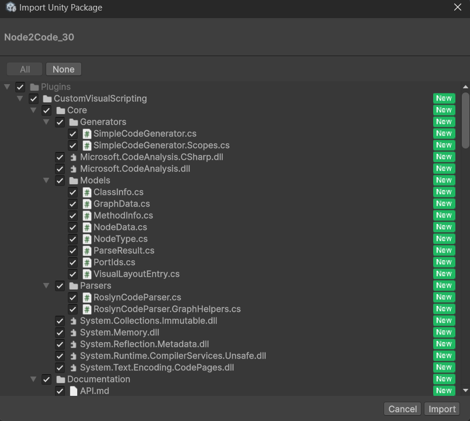
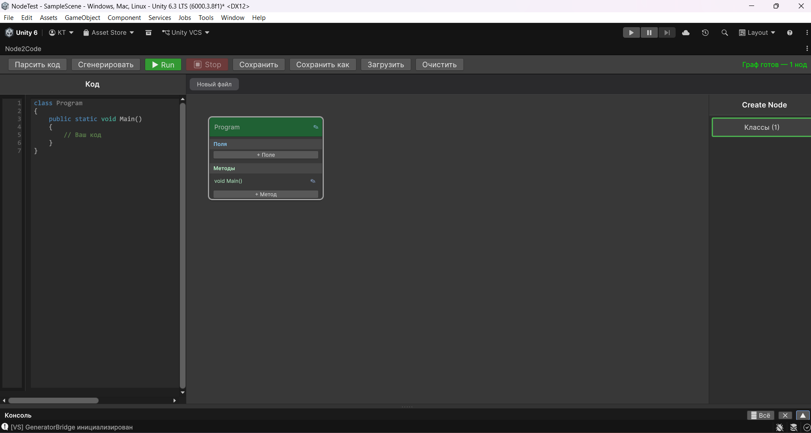

# 1. Установка и запуск плагина Node2Code

Добро пожаловать в Node2Code! Этот плагин позволяет создавать C# код для Unity двумя способами: классическим текстом во встроенном редакторе или с помощью визуального графа из блоков-нод.

---

## Установка

1. Скачайте файл **Node2Code.unitypackage**.
2. Откройте свой проект в Unity.
3. В верхнем меню выберите **Assets → Import Package → Custom Package…**.
4. Найдите скачанный `.unitypackage`, выберите его и нажмите **Open**.
5. В появившемся окне убедитесь, что отмечены все файлы, и нажмите **Import**.

---

## Запуск плагина

После установки в верхнем меню Unity появится пункт **Tools → Node2Code**.

1. Нажмите **Tools → Node2Code**, чтобы открыть рабочее окно плагина.
2. Вы можете закрепить его в любом удобном месте интерфейса Unity (например, рядом с окном Scene или Inspector), просто перетащив вкладку мышью.

 При первом запуске плагин автоматически создаёт стартовую структуру: класс `Program` и статический метод `Main()`.

