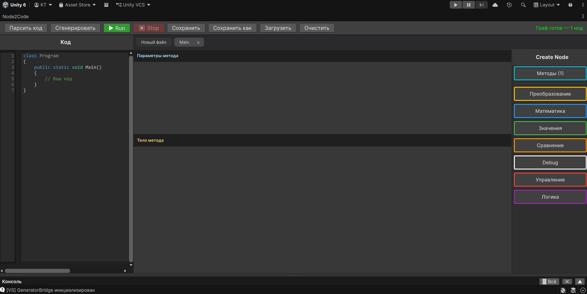

# 2. Обзор интерфейса и навигация

Интерфейс Node2Code разделён на несколько функциональных зон, которые меняют своё содержимое в зависимости от того, на каком уровне структуры вы находитесь.

---

## Функциональные зоны

### 1. Верхняя панель инструментов
Содержит глобальные кнопки управления проектом:
* **Парсить код** — считывает C# текст из левой панели и автоматически строит под него классы, методы и логику на холсте.
* **Сгенерировать** — собирает всю визуальную структуру с холстов в готовый C# код (отображается в левой панели).
* **Сохранить** / **Сохранить как** — автоматически преобразует текущий граф в C# код и сохраняет его в `.cs` файл. Граф не требует отдельного сохранения — при следующей загрузке этого файла он будет восстановлен в точности.
* **Загрузить** — открывает существующий `.cs` файл и разворачивает его в виде графа.
* **Очистить** — полностью удаляет все данные. Действие необратимо!

> **Важно:** Плагин хранит все данные внутри Unity-проекта как часть сцены или ассета. При нажатии «Сохранить» граф конвертируется в C# и записывается на диск. При повторной загрузке этого файла граф восстанавливается из кода.

### 2. Вкладки холстов (Верхняя часть холста)
Позволяют свободно переключаться между открытыми пространствами. Здесь отображаются вкладка холста классов, вкладки открытых методов и подпространства циклов или условий.

### 3. Левая панель «Код»
Здесь отображается текстовый C# код. Вы можете писать код руками и парсить его, либо собирать граф и смотреть, как плагин генерирует текст.

### 4. Центральный холст
Основная рабочая область для размещения нод и связывания их линиями. Поддерживается копирование и вставка нод через `Ctrl+C` / `Ctrl+V`.

### 5. Правая панель элементов
Контекстное меню создания элементов. Её содержимое зависит от текущего холста:
* **На холсте классов:** отображается только группа «Классы».
* **На холсте метода:** группа «Классы» скрывается, уступая место группам логики и математики.

---

## Навигация по уровням проекта

Программирование в плагине строится на переходе от общего к частному:

1. **Уровень классов (Верхний уровень):** Здесь вы видите общую архитектуру приложения. Ноды классов содержат списки полей и методов.
2. **Уровень методов (Средний уровень):** Нажатие на иконку **карандаша** рядом с методом внутри ноды класса переносит вас на холст этого метода.
3. **Уровень подпространств (Глубокий уровень):** Внутри методов ноды управления потоком (например, циклы или условия) открывают свои изолированные вкладки-подпространства для внутренней логики. Для перехода в подпространство используйте кнопки в левом верхнем углу холста (см. раздел «Метод»).

Для возврата на любой уровень вверх или переключения между ними просто выберите нужную **вкладку холста** в верхней части рабочей зоны.