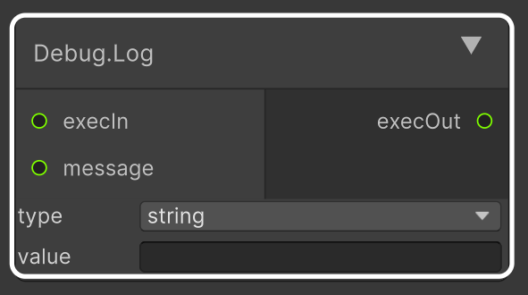

# 3. Глоссарий и основные понятия

Визуальное программирование в Node2Code использует стандартную терминологию, адаптированную под ООП (объектно-ориентированное программирование).

---

## Основные термины

* **Граф** — совокупность нод (блоков) и связей (линий) между ними на холсте, представляющая структуру или логику программы.
* **Нода (Узел)** — визуальный блок, обозначающий сущность (класс), операцию (сложение), значение (число) или конструкцию языка (условие).
* **Поток выполнения (Exec)** — последовательность выполнения команд. 
  * **Exec In (слева)** — входной сигнал, запускающий ноду.
  * **Exec Out (справа)** — выходной сигнал, передающий команду следующей ноде.
* **Поток данных** — передача значений между нодами. Например, выход ноды-числа соединяется со входом ноды сложения.
* **Типы данных** — плагин поддерживает строгую типизацию C#. Основные доступные типы: `int` (целое число), `float` (дробное число), `bool` (логическое истина/ложь), `string` (текст).
* **Подпространство** — изолированная внутренняя область холста внутри некоторых нод (циклов, условий), предназначенная для группировки их внутреннего содержимого.

---

## Анатомия ноды логики

Каждая нода на холсте метода устроена по общему принципу:


```

┌─────────────────────┐
│     Название        │
├──────────┬──────────┤
│ ○ Exec In│Exec Out ○│
│ ○ Вход A │Выход    ○│
├──────────┴──────────┤
│      Параметры      │
└─────────────────────┘

```

1. **Название** — имя операции или конструкции (например, `Add` или `Debug.Log`).
2. **Входы (Слева):** порты для приёма сигналов выполнения (`Exec In`) и входящих данных.
3. **Выходы (Справа):** порты для отправки сигналов выполнения (`Exec Out`) и результатов вычислений.
4. **Параметры (Снизу под названием):** внутренние настройки ноды (значения по умолчанию, имена переменных), редактируемые текстовым вводом или выпадающим списком прямо на блоке.

