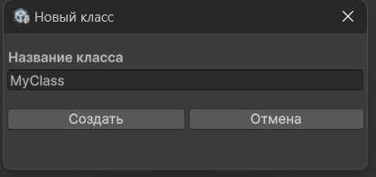
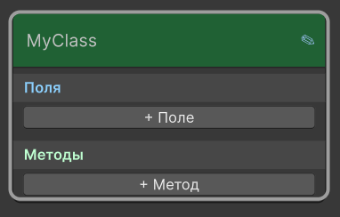
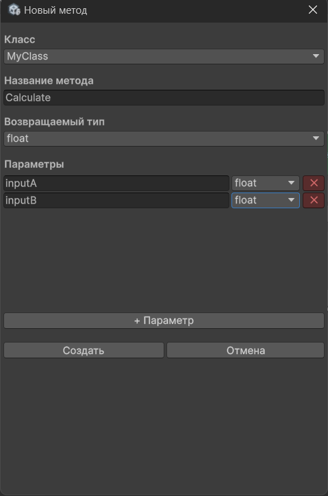
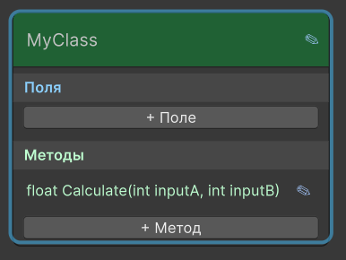

# 4. Проектирование архитектуры: Классы, Поля и Методы

При запуске плагина или открытии холста классов вы управляете объектной структурой вашей программы. На этом уровне недоступны математические или логические ноды — правая панель сфокусирована только на управлении классами.

> **Важно:** В текущей версии все поля и методы классов являются **статическими**. Поддержка экземплярных членов появится в одном из следующих обновлений.

---

## Создание класса

1. Убедитесь, что вы находитесь на главном холсте классов.
2. В правой панели откройте группу **«Классы»** и нажмите кнопку **«+ Создать класс»**.
3. В появившемся диалоговом окне введите имя класса (например, `MyClass`) и нажмите кнопку **«Создать»**.
4. Новый класс появится в списке правой панели и в виде большой ноды на холсте.

---

## Добавление полей класса

Поля — это переменные, принадлежащие самому классу, в которых хранятся его данные.

1. На ноде созданного класса нажмите кнопку добавления поля.
2. В открывшемся окне настроек укажите:
   * **Тип поля** (`int`, `float`, `bool`, `string`).
   * **Имя поля** (например, `myField`).
   * **Начальное значение** (значение, которое присвоится полю по умолчанию, например `123`).
3. Нажмите кнопку подтверждения. Поле отобразится внутри ноды класса.

---

## Добавление методов

Методы — это функции и действия, которые класс умеет выполнять.

1. На ноде класса нажмите кнопку добавления метода.
2. В окне настроек задайте:
   * **Тип возвращаемого значения** (`int`, `float`, `bool`, `string` или `void` для методов без возвращаемого значения).
   * **Имя метода** (например, `Calculate`).
   * **Параметры** (например, `inputA - float`, `inputB - float`).
3. Подтвердите создание. Метод добавится в список внутри ноды класса, а рядом с его именем появится **иконка карандаша**.

---

## Редактирование полей и методов

* **Поле:** на ноде класса нажмите кнопку **карандаш** (✏️) рядом с полем. Откроется окно, где можно изменить тип, имя или начальное значение.
* **Метод:** перейдите на холст метода (через карандаш у метода в ноде класса). Затем в правой панели откройте группу **«Методы»** – напротив имени метода появится кнопка карандаша для изменения параметров и возвращаемого типа.

Для удаления класса выделите его ноду на холсте и нажмите `Delete`.