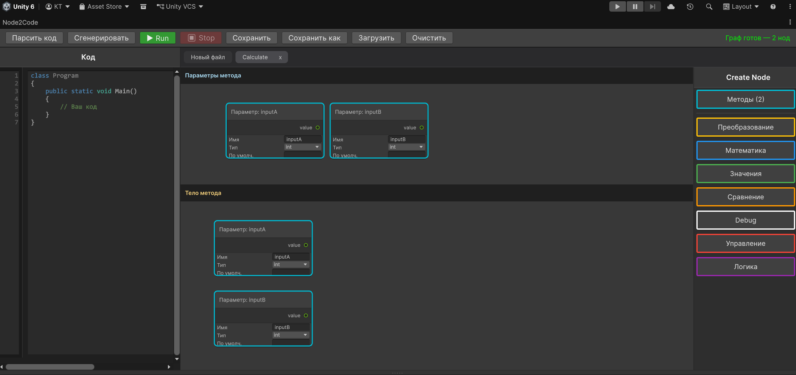

# 5. Реализация логики на холсте метода

Чтобы запрограммировать поведение метода, необходимо перейти на его персональный холст.

---

## Устройство холста метода

Нажмите на **иконку карандаша** рядом с нужным методом в ноде класса. Плагин откроет новую вкладку холста, разделённую на две части:

1. **Верхняя часть холста — «Параметры метода»:** Специальная визуальная зона, где настраиваются входящие аргументы метода. Здесь автоматически появляются ноды параметров (например, `n (int)`). Вы можете перетаскивать эти ноды и подключать их к другим нодам как источники данных.
2. **Нижняя часть холста — «Тело метода»:** Стандартное рабочее пространство графа, куда вы добавляете ноды действий для формирования алгоритма.

Когда вы переходите на холст метода, правая панель автоматически обновляется — из неё исчезает группа классов, и появляются группы для построения логики.

---

## Открытие подпространств (циклов, условий)

Когда вы добавляете на холст сложную ноду (`For`, `While`, `If`), в левом верхнем углу холста появляются кнопки для перехода в её внутренние вкладки. Например, у цикла `For` есть четыре подпространства: *Объявление*, *Граница*, *Шаг* и *Тело*. Нажмите на соответствующую кнопку, чтобы редактировать логику внутри.

---

## Правило запуска (Точка входа)

Выполнение кода внутри метода всегда идёт по цепочке связей **Exec**. 
* Программа определяет начало выполнения по ноде в «Теле метода», у которой **не подключен порт Exec In**. 
* Как правило, это первая смысловая нода алгоритма. От её порта `Exec Out` стрелка тянется к следующему действию.

---

## Возврат значения из метода

Чтобы метод вернул результат, используйте ноду **Return** (категория «Управление»). Нода имеет входы `execIn` и `value`, выходов у неё нет. Подключите `execOut` последней ноды алгоритма к `execIn` ноды `Return`, а на порт `value` подайте вычисленное значение. После выполнения `Return` метод завершается и возвращает переданное значение.

---

## Работа со значениями и переменными

Для оперирования данными используйте ноды из категории **«Значения»** (бывшие Literals). Каждая нода (`Int`, `Float`, `Bool`, `String`) может работать в двух режимах:

* **Конкретное значение (Литерал):** Если параметр `name` внизу ноды **пустой**, блок выдаёт через порт `output` обычное статичное число или строку, заданную в поле `value`.
* **Переменная:** Если в параметр `name` вписано имя, нода объявляет переменную.
  * **Чтение:** Ссылайтесь на переменную, используя порт `output` на любой ноде с этим именем.
  * **Запись (Присвоение):** Подайте новое значение на вход `inputValue` любой из нод с этим именем. Все ноды с одинаковым именем в рамках одного метода связаны между собой.

> **Важно:** Переменные, созданные внутри подпространств (например, внутри цикла), не видны на основном холсте метода.