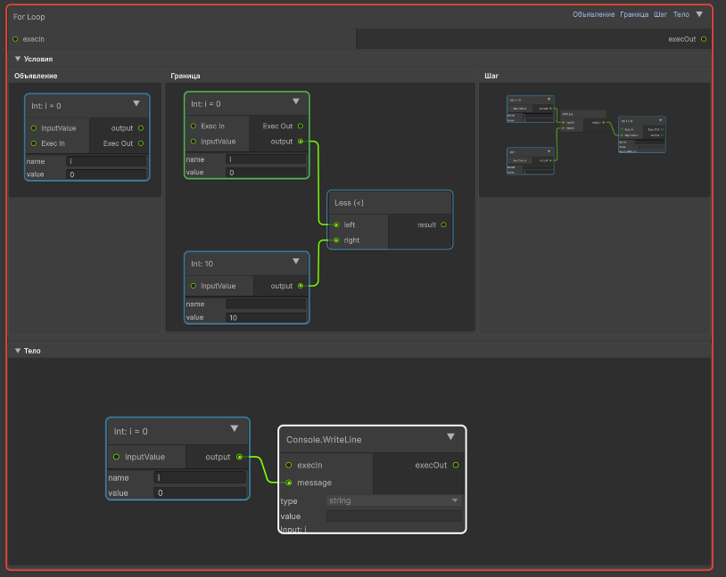
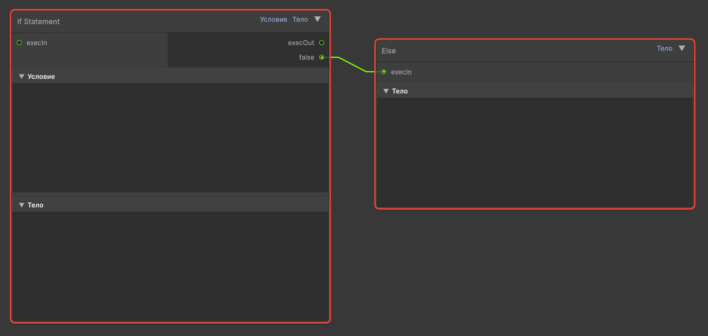

# 6. Справочник нод (Холст метода)

В данном справочнике приведены все доступные ноды логики, сгруппированные по русскоязычным категориям из правой панели.

---

## 1. Математика (Math)
Выполняют арифметические операции над числами (`int`, `float`). Все ноды содержат входы данных `inputA`, `inputB` и выход `output`.

* **Add** — сложение ($A + B$)
* **Substract** — вычитание ($A - B$)
* **Multiply** — умножение ($A * B$)
* **Divide** — деление ($A / B$)
* **Modulo** — остаток от деления ($A \% B$)
* **Mathf.Max** — выбор наибольшего из двух чисел.
* **Mathf.Min** — выбор наименьшего из двух чисел.
* **Mathf.Abs** — модуль числа (вход `input`, выход `output`).

---

## 2. Логика (Logic)
Операции с булевыми значениями (`bool`).

* **And** (Логическое И) — возвращает true, если оба входа `left` и `right` истинны.
* **Or** (Логическое ИЛИ) — возвращает true, если хотя бы один вход `left` или `right` истинен.
* **Not** (Логическое НЕ) — инвертирует входящий сигнал с порта `input` на противоположный.

---

## 3. Сравнение (Comparison)
Сравнивают два значения и возвращают результат в виде `bool` на выход `result`. Имеют входы `left` и `right`.

* **Equal** — равно (`==`)
* **Not Equal** — не равно (`!=`)
* **Greater** — больше (`>`)
* **Less** — меньше (`<`)
* **Greater Or Equal** — больше или равно (`>=`)
* **Less Or Equal** — меньше или равно (`<=`)

---

## 4. Debug и Управление (Flow)
Ноды для вывода информации, ветвления потока и возврата значений.

* **Debug.Log** *(Категория: Debug)* — выводит сообщение в консоль Unity.
  * Входы: `execIn`, `message` (выводимое значение). 
  * Выходы: `execOut`. 
  * Параметры: `type` (тип данных сообщения: `int`, `float`, `bool`, `string`), `value` (текст по умолчанию, если к `message` ничего не подключено). Параметр `type` определяет, как интерпретировать `value`.
* **Console.WriteLine** *(Категория: Управление)* — системный аналог `Debug.Log` для вывода в стандартную консоль. Параметры и порты идентичны.
* **Return** *(Категория: Управление)* — завершает выполнение метода и возвращает значение.
  * Входы: `execIn`, `value`. Выходов нет.

### Сложные ноды управления (с подпространствами)

* **For (Цикл со счётчиком)** — выполняет итерационный цикл.
  * Открывает 4 внутренних подпространства (кнопки в левом верхнем углу холста): *Объявление* (создание счётчика), *Граница* (проверка окончания), *Шаг* (изменение счётчика), *Тело* (код цикла).
  * **Пример настройки цикла For:**
    1. *Объявление* – создайте переменную-счётчик (нода `Int` с заполненным полем `name`, например `i`). Задайте начальное значение через `value`.
    2. *Граница* – разместите ноду сравнения (например, `Less`). Подключите выход счётчика к `left`, а конечное значение (или переменную) к `right`. Выход `result` этой ноды станет условием продолжения цикла.
    3. *Шаг* – выполните операцию над счётчиком (например, `Add` с константой 1). Результат запишите обратно в переменную (подключите `output` ноды сложения к `inputValue` ноды счётчика).
    4. *Тело* – разместите любые ноды, которые должны выполняться на каждой итерации.
  * Выход `execOut` на основном холсте сработает только тогда, когда цикл полностью завершится.
  
  

* **While (Цикл с предусловием)** — выполняет код, пока условие истинно.
  * Открывает подпространства *Условие* (должно возвращать `bool`) и *Тело*.
* **If (Условный оператор)** — разветвляет программу.
  * Имеет подпространство *Условие* (возвращает `bool`) и *Тело* (выполняется, если true).
  * Выход `False` служит для подключения ноды **Else**.
* **Else** — используется строго в связке с `If`. Подключается к порту `False` ноды `If`, открывая подпространство *Тело* для ложного сценария.

---

## 5. Преобразование (Conversion)
Используются для явного изменения типов данных, чтобы соблюдать правила строгой типизации при соединении портов.

| Нода | Вход | Выход | Аналог в C# |
|------|------|-------|-------------|
| **float.Parse** | `input` (string) | `output` (float) | `float.Parse(input)` |
| **int.Parse** | `input` (string) | `output` (int) | `int.Parse(input)` |
| **ToString** | `input` (любой тип) | `output` (string) | `input.ToString()` |

> Обратите внимание: Имена нод `float.Parse` и `int.Parse` пишутся с заглавной буквы **P**.