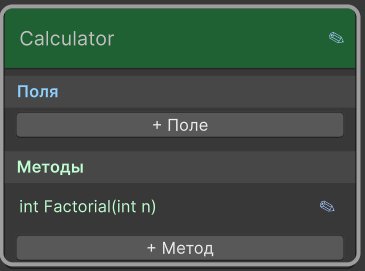
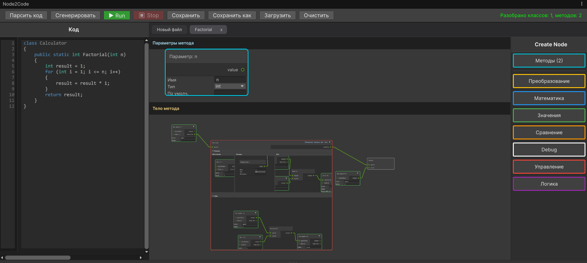

# 7. Пошаговый практический пример

Давайте создадим полноценный вычислительный класс с методом, использующим цикл, условие, переменные и возврат значения. Мы реализуем **факториал числа**.

Итоговый C# код будет выглядеть так:

```csharp
class Calculator
{
    public static int Factorial(int n)
    {
        int result = 1;
        for (int i = 1; i <= n; i++)
        {
            result = result * i;
        }
        return result;
    }
}
```

---

## Шаг 1. Подготовка холста

1. Откройте плагин через **Tools → Node2Code**.
2. Нажмите кнопку **«Очистить»** на верхней панели, чтобы начать работу с чистого листа.

---

## Шаг 2. Создание класса Calculator

1. Убедитесь, что вы на главном холсте классов.
2. В правой панели «Классы» нажмите **«+ Создать класс»**.
3. Введите имя `Calculator` и нажмите **«Создать»**.
4. На появившейся ноде класса `Calculator` нажмите кнопку добавления метода.

---

## Шаг 3. Добавление метода Factorial

В окне настроек метода укажите:
- **Тип возвращаемого значения:** `int`
- **Имя метода:** `Factorial`
- **Параметры:** `n - int`

Подтвердите создание. Теперь нода `Calculator` содержит метод `Factorial` с иконкой карандаша.



---

## Шаг 4. Переход на холст метода

Нажмите на **иконку карандаша** рядом с `Factorial`. Откроется холст метода.

В верхней части холста появится нода параметра `n`. Это источник данных, который вы будете использовать внутри метода.

---

## Шаг 5. Создание переменной result

1. В правой панели выберите категорию **«Значения»**, добавьте ноду **Int**.
2. В параметре `name` ноды напишите `result`.
3. В параметре `value` поставьте `1` (начальное значение).
4. Теперь у вас есть переменная `result`. Вы можете читать её через порт `output` и записывать через `inputValue` (подавая сигнал выполнения на `execIn`).

---

## Шаг 6. Добавление цикла For

1. Из категории **«Управление»** добавьте ноду **For**.
2. Соедините порт `execOut` ноды `result` (или любой стартовой ноды) с `execIn` цикла `For`. Так выполнение войдёт в цикл.

### Настройка подпространств цикла

В левом верхнем углу холста появятся четыре кнопки. Открывайте их по очереди:

- **Объявление:** Создайте переменную-счётчик `i` (нода `Int`, `name = i`, `value = 1`). Не нужно соединять её по `exec` – достаточно, чтобы нода существовала. Плагин распознает её как объявление.
- **Граница:** Добавьте ноду **Less Or Equal** (≤). Подключите выход `i` (порт `output` ноды счётчика) к `left`, а выход параметра `n` (из верхней зоны) к `right`. Выход `result` этой ноды станет условием продолжения цикла. (Плагин сам использует его.)
- **Шаг:** Добавьте ноду **Add**. `inputA` = выход `i`, `inputB` = константа 1 (создайте ноду `Int` со значением 1 без имени). Выход `Add` подключите к порту `inputValue` ноды `i`. Также подайте сигнал выполнения: порт `execOut` из шага должен идти на `execIn` этой же ноды `i`, но обычно шаг выполняется автоматически; достаточно просто описать присвоение. *(На практике: в подпространстве «Шаг» разместите описанную логику, плагин сгенерирует `i = i + 1`.)*
- **Тело:** Здесь будет условие и умножение (см. следующий шаг).

---

## Шаг 7. Логика внутри тела цикла

В подпространстве **Тело** цикла `For`:

1. Добавьте ноду **If** (Управление). Подключите `execIn` от входа в тело (порт `execIn` подпространства) к `If`.
2. Настройте условие: добавьте ноду **Equal**. `left` = выход `i`, `right` = 0 (нода `Int` со значением 0). Выход `Equal` подключите к порту `condition` ноды `If`.
3. В подпространство **Тело** ноды `If` (истинная ветка) ничего не добавляйте – просто оставьте пустым (это аналог `continue`).
4. К порту `False` ноды `If` подключите ноду **Else**. В подпространстве **Тело** ноды `Else` разместите:
   - Ноду **Multiply**. `inputA` = выход переменной `result`, `inputB` = выход `i`.
   - Результат умножения (выход `output`) подключите к `inputValue` переменной `result`. 
   - Подайте сигнал выполнения: `execOut` из `Else` (или из `If`, если `Else` нет) должен дойти до `execIn` ноды `result`, чтобы запись произошла. Удобно: внутри тела цикла сначала проверяем `If (i == 0)`, затем в `Else` делаем умножение и запись. Поток выполнения: `execIn` тела → `If` → (по ложной ветке) → `Else` → внутри `Else` умножение и запись → выход из `Else` → конец тела цикла.

> Для простоты: после `Else` можно ничего не подключать, плагин сам сгенерирует правильный порядок. Или явно соедините `execOut` ноды `Else` с `execIn` ноды `result`.

---

## Шаг 8. Возврат результата

Вернитесь на **основной холст метода** (нажмите вкладку `Factorial`). После ноды `For` (выход `execOut` цикла) добавьте ноду **Return** (категория «Управление»).

- Подключите `execOut` цикла `For` к `execIn` ноды `Return`.
- На порт `value` подайте выход переменной `result` (порт `output` ноды `Int` с именем `result`).



---

## Шаг 9. Генерация и сохранение кода

1. Нажмите кнопку **«Сгенерировать»** на верхней панели. В левой панели «Код» появится готовый C# код.
2. Нажмите **«Сохранить как»**, выберите папку в `Assets` и сохраните файл, например `Calculator.cs`.

Поздравляем! Вы создали полноценный алгоритм с циклом, условием, переменными и возвратом значения, используя визуальное программирование.

---

## Примечание по сохранению

При нажатии «Сохранить» плагин автоматически конвертирует текущий граф в C# и записывает его в файл. При повторной загрузке этого файла через кнопку **«Загрузить»** граф будет восстановлен в точности.